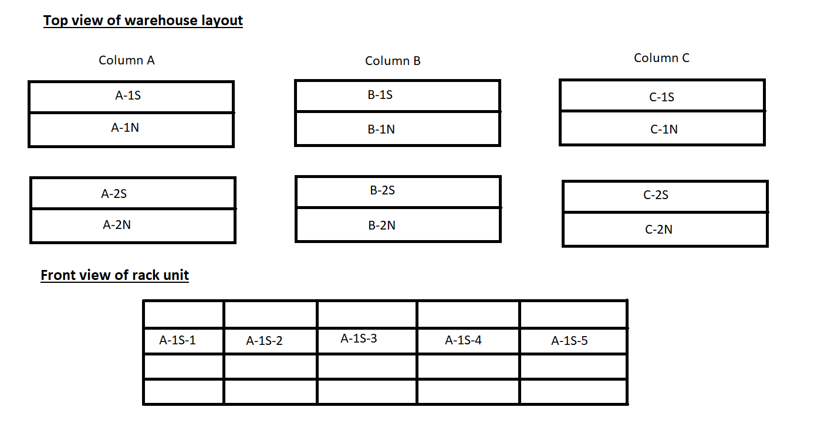

### A Little Backstory
When I started working for my previous employer, Shoe Box, in 2012, inventory was taken the old fashioned way; with pen and paper. Of course, this old method is prone to many errors.  I knew there had to be a better way of doing inventory. 

As time went by, I gained a lot of trust and respect from my supervisors and colleagues by taking initiative on various tasks and responsibilities. And so, my quest to overhaul the inventory process started around 2014. I didn't have any programming skills when I started this venture. Though, I had more than enough Excel and PC skills to rig something together. It started out as filling in an Excel worksheet with Sku and Quantity pairs. While it was a bit faster than pen and paper, it still wasn't quite cutting it.

One day when I was repairing a colleague's PC, I found an old USB barcode scanner in the network room. I was ecstatic because I knew scanning barcodes was going to be much faster and easier. But I still had a hurdle to overcome. I needed a way to match the barcode values with Sku values. We had been using an e-commerce platform, ChannelAdvisor, that contained all the product data. 

After some Googling and messing around, I figured out a way. I automated daily inventory exports from ChannelAdvisor so that I had a sort of "database" of the products in an Excel workbook. Then, I was able to match up the values using a combination of `INDEX` and `MATCH` Excel functions. What was great about this solution is that it was easy to do and understand for other colleagues who had experience with Excel. I eventually made an Excel macro to make it as easy as opening files and clicking a button, making it even more efficient.

The solution worked well but it still needed work. One issue was having to process barcode data that wasn't a [UPC](https://en.wikipedia.org/wiki/Universal_Product_Code) barcode. There were also [EAN](https://en.wikipedia.org/wiki/International_Article_Number) and [Code128](https://en.wikipedia.org/wiki/Code_128) barcode types on various products. These had to be identified separately then added back to the first list where it matched with a `UPC` value. This new issue prompted me to re-write the Excel macro to compensate for the additional barcode types.

With smartphones becoming more powerful, I started experimenting with barcode scanning apps. I tested several apps and the one that stood out most was [Inventory Scanner X](https://apps.apple.com/mn/app/inventory-scanner-x/id869229278) (which at the time was called `Inventory Scanner`). It was the most feature rich and the fastest at scanning. One of the coolest features is that it can take an image of each scan. This came in handy for product that wasn't in the database. Some of the barcodes had the product `Sku` on the barcode label itself making it easy to identify and add the product to the database.

At this point, I had about 3 semesters of programming under my belt. I didn't quite have all the knowledge and skill necessary to build my own inventory program yet. But I had enough skills to start building version 1 of the [Box Content Labeler](/portfolio/box-content-labeler) program. What I found challenging at the time was how to design the database. Because we were dealing in shoes, there's one `parent` product that has `children` product of which are the varying sizes. Nonetheless, I constantly thought about how to approach that challenge & various features that an inventory program would need, particularly for our environment. I also constantly thought about how to seamlessly implement it with least resistance. It gave me a better foundation for starting the inventory program.

After graduating from CNM in Spring of 2017, I felt more confident and ready to tackle an inventory program. To accompany the inventory program, I also thought it would be essential to implement a warehouse location system. It would aid in finding products in the 30,000 square foot warehouse. The pattern was similar to that of an Excel sheet; columns were lettered, and rows numbered. Additionally, either "N" or "S" were appended to the row number to designate which way it was facing, north or south. A section number was added to futher pinpoint the section of a row. Lastly, a barcode and label was also placed at every section to quickly identify the location. 

Since everyone was already used to scanning into a plain text file and the [Inventory Scanner](https://apps.apple.com/mn/app/inventory-scanner-x/id869229278) app produced text files, I built the app to process text files. The only addition to the process for workers was to scan the location barcode before scannning everything in that section. I chose this approach so that those who were tasked to scan inventory could do so very easily and anyone could quickly learn and hop on the task.

### The Program Details
To implement this program I used the .Net Framework and wrote it in C#. I used Entity Framework and a SQL Server database for data, of which I designed myself using the Code-First approach. Lastly, I used [EPPlus](https://github.com/JanKallman/EPPlus) for Excel workbook generation. To get this running and start using immediately, I wrote it as a console program. I wanted to get all the backend features built first before I worried about a GUI.

The program starts by reading in all the lines of a text file into a `List` of type `string` and then does some RegEx comparison to determine what type; `UPC`, `EAN`, `Code128/FNSKU`, `Unknown` or `WarehouseLocation`. If the type is a `WarehouseLocation` it saves it as the current location so that subsequent strings are known to be at that location. If it's `Unknown` it saves it in a separate `UnknownsList`. If all others type (we'll call them `identifiers`), it tries to retrieve the product from the database. If not found, the `identifier` is also added to the `UnknownsList`. As products are found they are added to a `ProductsList` and quantity for each is tallied up.  Depending on the purpose of the scan, the program takes a few different turns. 

Essentially, a resulting Excel workbook is generated with all the pertinent information needed to update inventory in ChannelAdvisor, as well as info that is useful for various workers in the warehouse. I chose to generate Excel workbooks because everyone else was already familiar and proficient with it. It wouldn't require any special training. Rather, just be taught how to interpret the resulting workbooks, which were quite self-explanatory.

##### Full Brand Scan Session
When we would do inventory, we would do it on a brand by brand basis. This is how they were doing it before I even started working there. In order to preserve what everyone was already accustomed to, I kept this form and adapted the program to it. 

So, once a `ProductsList` is compiled, a unique list of all the products' `ClassificationId`s is compiled. Then, all products for each `ClassificationId` are also retrieved. This list is saved in an `AllProductsList` to be cross-referenced with the `ProductList`. If a product is not in the `ProductsList` a `0` was entered for the quantity and the `WarehouseLocation` is set to ` `\` `, else the quantity is set from the `ProductsList`.

Next, a `Consolidation` is done on `AllProductsList`. It examines the scanned location of products to determine if there are two or more of the same product in more than one location. If so, a `ConsolidationList` is compiled. This was particularly very helpful and useful for all warehouse workers. In the past, this was a very difficult thing to do because we had no method. We would do this visually which was not always accurate and often prone to errors. This consolidation feature improved overall efficiency and organization in the warehouse.

To complement `Consolidation`, a `SinglesList` is also compiled for products where there's only 2 or less quantity of its kind. The warehouse practice was to move `singles` to the end of the brand. It helped keep the warehouse organized 

Finally, the program database is updated with new `WarehouseLocation`s for each product. As aforementioned, an Excel workbook is generated with all of the various data compiled in their respective worksheets. 
    
 - `ScanData` worksheet is the original text file data.
 - `List` worksheet is the `ProductsList` data
 - `Unknowns` worksheet of `UnknownsList` data
 - `Consolidation` worksheet only if there are products to consolidate
 - `Singles` worksheet for any `singles` in the scan session
 - `ChannelAdvisorUpload` worksheet is `AllProductsList` data. This is what will actually be uploaded into ChannelAdvisor 

##### Receiving Scan Session
If the scan session is for the purpose of receiving and unpacking products, things are handled differently after `ProducsList` is compiled. Since this is product that is being received, it's possible that we have more of a particular product already on a shelf. Instead of any kind of `Consolidation` or `Singles` work, it makes a SOAP API call to ChannelAdvisor to check if there is already inventory in the warehouse. If there is, a `IntegrationList` is generated. We can then use this list to integrate the newly received product with it's respective siblings that are already on the shelf. This again, greatly increased efficiency and organization in the warehouse. 

A similar Excel workbook is generated as that of the `Full Brand Scan Session` with an `Integration list` worksheet taking the place of the `Consolidation` and `Singles` worksheets. 

##### Location Updates
Later I added a small update to add the ability to update product locations. After a few weeks of shipping products, we would need to condense product to make room on the shelves for more products coming in. Often it involved moving an entire product and it's children down a shelf or two. This meant that it's location would need to be updated. Instead of doing a full brand scan to accomplish this, it would be easiest to scan only one of the `children` and update that locations for it's siblings as well. 

##### Product and Database Updates
When I was ready to actually start running scan files, I ran into the issue of seeding the database. I was first trying to do it in C# by opening a text file and inserting each row into the database. With 200,000 products, that approach was inadequate and would've taken far too long to complete (we're talking days here). After some Google work, I discovered `BULK INSERT` using SQL. Using this approach, I was able to seed the database and get started in 12 minutes. 

To save myself some headaches, I wrote various stored procedures to be able to quickly do this whenever I needed to. For a while, this was the way I would update the database with new product. Though, it quickly proved to be annoyingly tedious. I knew there had to be a better way.

I needed the ability to update the database with new products from ChannelAdvisor. With zero experience using a SOAP API, I got to reading and studying and was able to implement it. I made an update feature that queries the database for the last time it updated itself. Using that date, I would send the API request to get all newly created products from that date to `DateTime.Now`. If the product doesn't exist, it's added to the database or else just skipped over.

##### Wrap-up
As mentioned before, the program is a console program. I started it this way so that I can focus on the functionality before worrying about a GUI. Because I wrote it during work hours when time permitted, it took some time to write it and work out all the bugs by myself. I was beginning to work on a GUI for the program but then COVID-19 happened and I was laid off. 

When I was laid off, I was also in the process of looking for employment as a full-time developer. I had an interview lined up but it had to be cancelled due to COVID. I advised my supervisors to rehire other people who really needed the job before me. Fortunately, I was in a good financial spot to be able to make that decision. 

Thankfully, they rehired another colleague who does web design and knew enough to be able to take over the program. They've done a few updates to enhance the user interface of the program and added some other functionality. I feel good and like I've left it in good hands. I left Shoe Box on good terms and they wish me the best of luck on my endeavors.

All in all I'm proud of this work and how hard I worked on it. The program continues to be used everyday for all inventory related tasks. I own the repo on Github, though it is private. I'd be happy to share it upon request to showcase my work and skills to potential employers. Hopefully this post didn't bore anyone and was somewhat intersting.